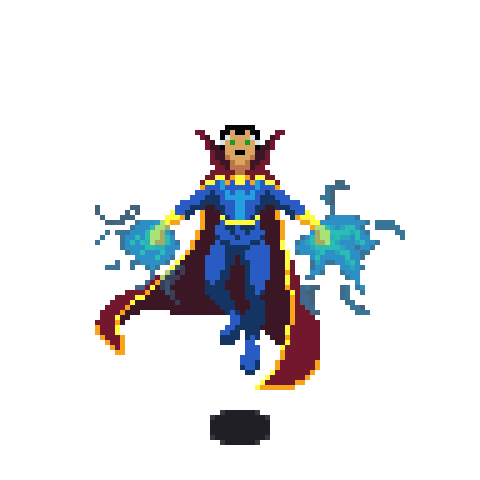

  

 

  

  # Amit Divekar 👨‍💻

  **uffamit** · he/him · 1 follower · 4 following  

  🌟 **Currently working on**: A professional portfolio website with 3D-like animations and an AI-powered skills graph, hosted on Vercel.  
  🚀 **Exploring**: Advanced React patterns, API integrations, and scalable web architectures.

 

## 🏆 Achievements
- 🦈 **Pull Shark**: Contributed impactful pull requests to open-source projects.  
- ⚡ **Quickdraw**: Rapidly resolved issues and merged code with precision.

## 🛠️ Tech Stack

## 📌 Pinned Projects
- **[eatinformed](https://github.com/uffamit/eatinformed)** An AI-driven nutrition app with a sleek landing page using glassmorphism and interactive animations.  
  *TypeScript* 

- **[mini-project](https://github.com/uffamit/mini-project)** A compact TypeScript project exploring innovative UI/UX solutions.  
  *TypeScript* 

- **[portfolio](https://github.com/uffamit/portfolio)** A modern, responsive portfolio with 3D animations and an AI-driven skills graph, hosted on Vercel.  
  *TypeScript*
   

## 📊 GitHub Stats

## 📫 Get in Touch
- 📧 [Email](mailto:amitdivekar289@gmail.com)
